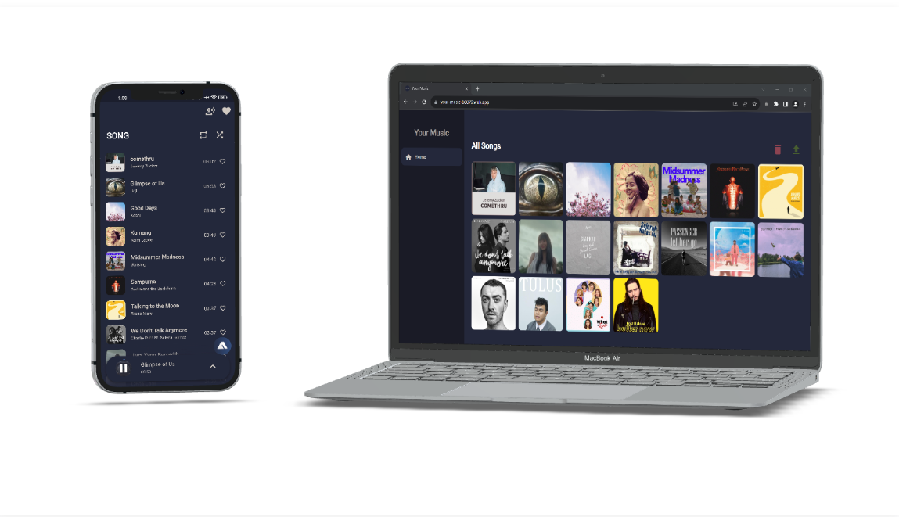

# Your Music

>Where Control Meets Convenience.

Your Music is the ultimate music companion, allowing you to manage and enjoy your music seamlessly. Explore the features below.

## Key Feature 🎉
- **Web Dashboard:** Manage your music library effortlessly from anywhere.
- **Android App:** Access your music collection on the go, with real-time notifications.
- **Play and Enjoy:** Listen to your favorite tracks with playback controls and smooth navigation.
- **Voice Assistant:** Control your music using voice commands for a futuristic touch.
- **Favorites:** Mark your beloved songs as favorites for quick access.
- **Seamless Sync:** Keep your music collection in sync across devices seamlessly.

## Demo 🎶

### 🌐 Web App Dashboard
| Section                | Description                                      | Mobile App Notification Demo |
|------------------------|--------------------------------------------------|-----------------------------|
| Login to Home          | <video width="320" height="240" controls><source src="assets/preview/web_1.mp4" type="video/mp4"></video> In this section, we demonstrate how easy it is to log in and access your personalized music dashboard. |                             |
| Show Detail and Play Song | <video width="320" height="240" controls><source src="assets/preview/web_2.mp4" type="video/mp4"></video> Discover how to access detailed song information and start playing your favorite tracks effortlessly. |                             |
| Add Song               | <video width="320" height="240" controls><source src="assets/preview/web_3.mp4" type="video/mp4"></video> Learn how to expand your music collection by adding new songs with a few simple steps. | <video width="320" height="240" controls><source src="assets/preview/wm_3.mp4" type="video/mp4"></video> **Mobile Notification:** After adding a song on the web app, see how the mobile app provides a notification confirming the addition. |
| Update Song            | <video width="320" height="240" controls><source src="assets/preview/web_4.mp4" type="video/mp4"></video> Explore the functionality of updating song details to keep your library organized. | <video width="320" height="240" controls><source src="assets/preview/wm_4.mp4" type="video/mp4"></video> **Mobile Notification:** When you update a song's details on the web app, experience how the mobile app instantly reflects these changes with a notification. |
| Delete Song            | <video width="320" height="240" controls><source src="assets/preview/web_5.mp4" type="video/mp4"></video> See how easy it is to remove songs that you no longer want in your collection. | <video width="320" height="240" controls><source src="assets/preview/wm_5.mp4" type="video/mp4"></video> **Mobile Notification:** After deleting a song through the web app, observe how the mobile app notifies you about the successful removal. |

### 📱 Android App Client:
| Section                | Description                                      | Mobile App Demo                              |
|------------------------|--------------------------------------------------|---------------------------------------------|
| Splash Screen & Home | Experience the smooth start of the 'Your Music' mobile app with an engaging splash screen, followed by quick access to your personalized music dashboard. | <video width="320" height="240" controls><source src="assets/preview/mobile_1.mp4" type="video/mp4"></video> |
| Add to Favorites       | Discover how easy it is to add your favorite songs to your collection with just a tap. | <video width="320" height="240" controls><source src="assets/preview/mobile_2.mp4" type="video/mp4"></video> |
| Play Song              | Play your selected songs, view detailed descriptions, lyrics, and navigate between tracks with ease. | <video width="320" height="240" controls><source src="assets/preview/mobile_3.mp4" type="video/mp4"></video> |
| Voice Assistant        | Utilize voice commands to control song playback and access features hands-free. | <video width="320" height="240" controls><source src="assets/preview/mobile_4.mp4" type="video/mp4"></video> |

Enjoy the seamless experience of managing and enjoying your music with 'Your Music'!

## Get Started

- [Visit the Web App Dashboard](https://your-music-88879.web.app/)
- [Download the Mobile App Client](https://github.com/vstacked/your-music/releases)